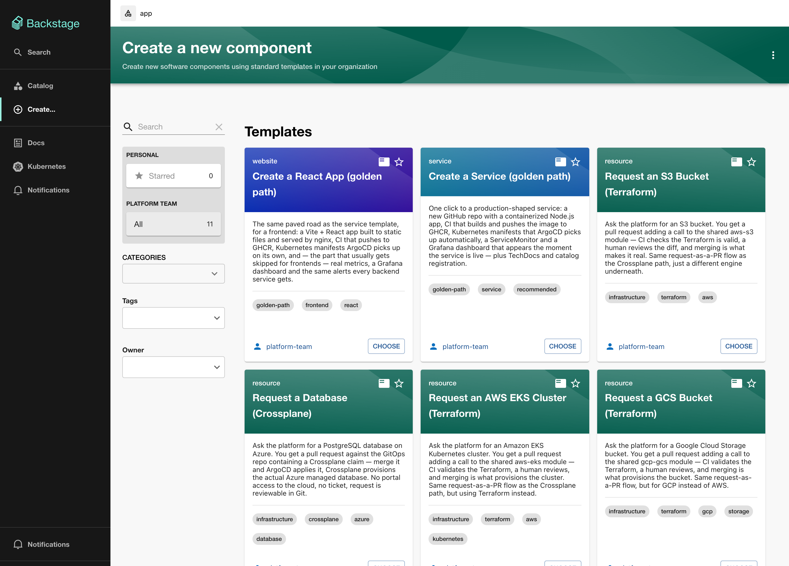
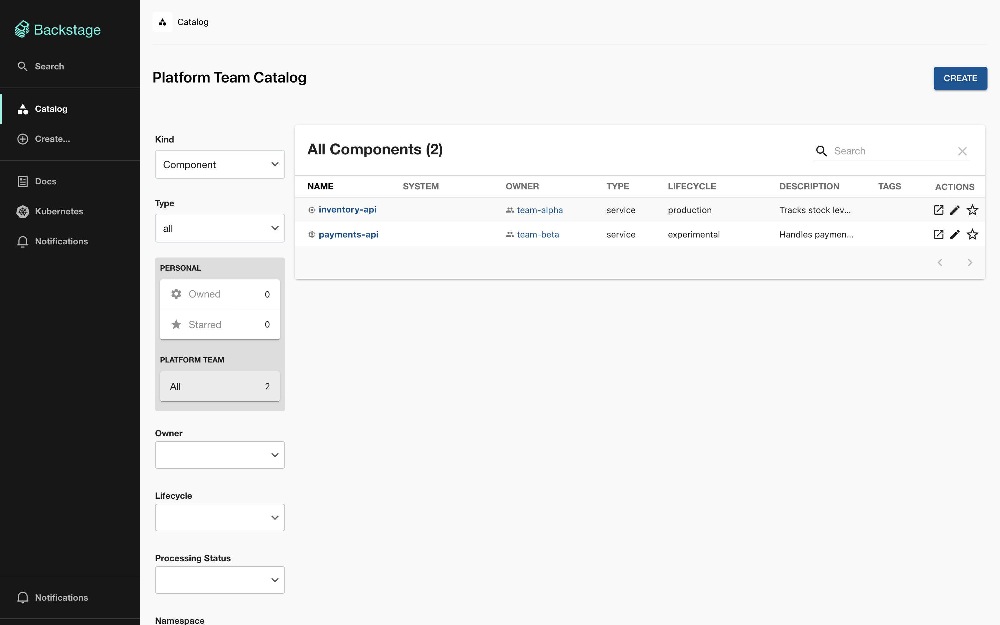
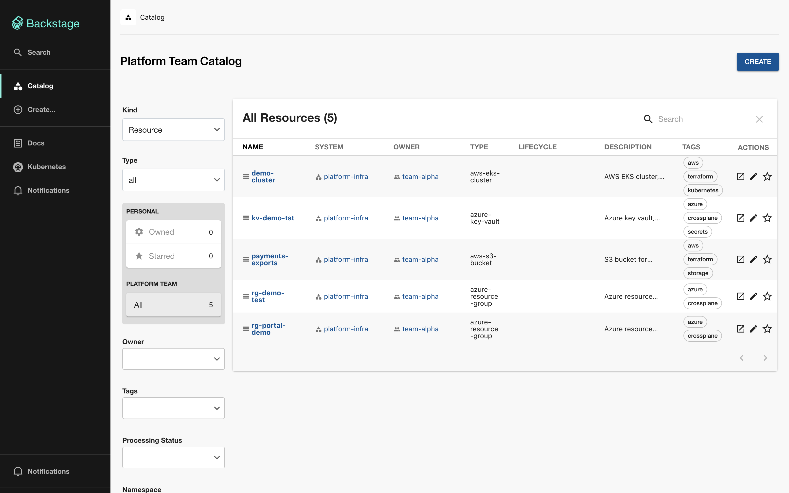
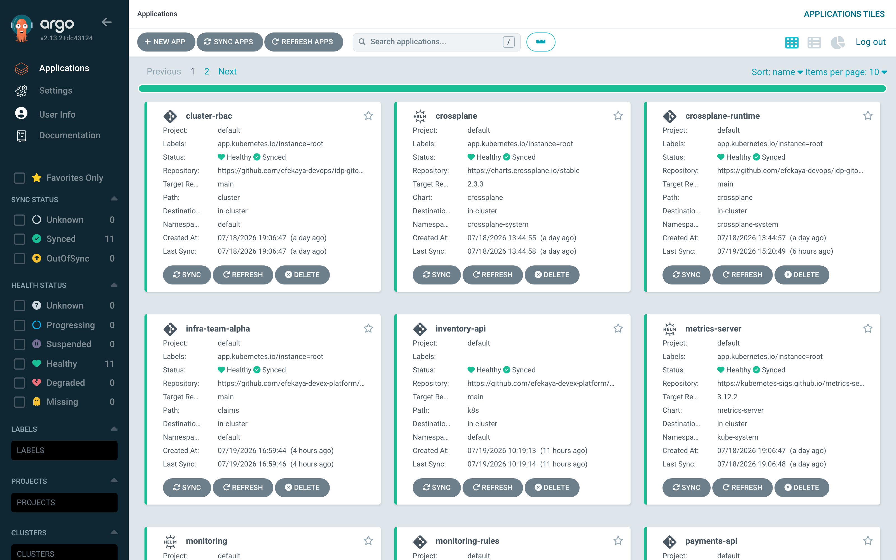
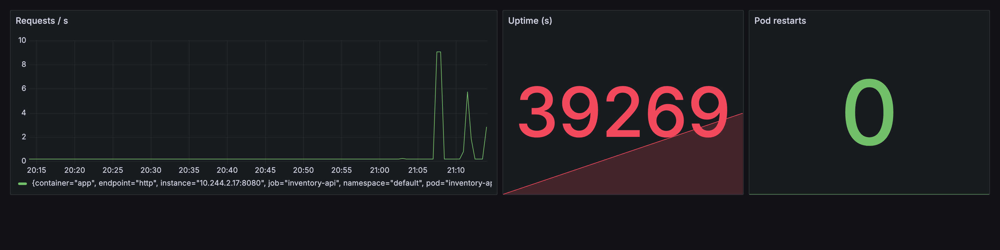

# backstage-idp

The portal side of the platform. Two golden paths create running apps — a
backend service and a React frontend — and the rest request infrastructure:
Crossplane claims on the Azure side, Terraform module calls for AWS and GCP.

Companion repos:
[idp-gitops](https://github.com/efekaya-devops/idp-gitops) (cluster, argocd, monitoring) ·
[terraform-modules](https://github.com/efekaya-devops/terraform-modules) ·
[crossplane-modules](https://github.com/efekaya-devops/crossplane-modules) ·
[platform-docs](https://github.com/efekaya-devops/platform-docs) ·
[team-alpha](https://github.com/efekaya-devex-platform/team-alpha) (a team's requested infra)

## screenshots
full index in **[assets/](assets/)**.

| | |
|---|---|
|  |  |
| **The portal.** Eleven templates: two golden paths, nine ways to ask for infrastructure. | **The catalog.** Services register themselves, owner and all. |
|  |  |
| **Infrastructure is catalogued too.** Everything a team asked for, with an owner — not just the services. | **ArgoCD.** Every app synced and healthy, including a team's own claims. |
|  |  |
| **Discovery by convention.** Nobody told ArgoCD this service existed — it found the repo and built the whole tree. | **The dashboard nobody created.** Prometheus scrapes `/metrics`, Grafana's sidecar loads the panel. |
|  | |
| **It notices when things break.** `ServiceDown` firing on a service nobody wrote an alert for. | |

## the templates

| Template | Produces | Who applies it |
|---|---|---|
| `create-service` | a **new github repo** — node app, dockerfile, CI, k8s manifests, servicemonitor, grafana dashboard, techdocs | argocd, on its own |
| `create-react-app` | same, but a **vite + react** app served by nginx, with an exporter sidecar so a frontend still gets metrics, a dashboard and alerts | argocd, on its own |
| `request-resource-group` | a **pull request** on team-alpha adding a Crossplane claim | argocd, once merged |
| `request-database` | same, a PostgreSQL server + db claim | argocd, once merged |
| `request-keyvault` | same, a Key Vault claim | argocd, once merged |
| `request-virtualnetwork` | same, a VNet + subnet claim | argocd, once merged |
| `request-webappplatform` | same, an App Service platform claim | argocd, once merged |
| `request-bucket` | a **pull request** on team-alpha adding terraform (`infra/aws/`, S3) | nothing — CI validates only |
| `request-eks-cluster` | same, an EKS cluster module call | nothing — CI validates only |
| `request-gcs-bucket` | same, a GCS bucket module call (`infra/gcp/`) | nothing — CI validates only |
| `request-gke-cluster` | same, a GKE cluster module call | nothing — CI validates only |

Every infra request also writes a `catalog/<name>.yaml` Resource entity into
the same pull request. The portal scans the team repo for `catalog/*.yaml`
(`catalog.providers.github` in app-config), so merging the PR is what puts the
resource on the catalog — owner, environment tags, a link to the file in git,
and its dependencies. Same discovery-by-convention as services: nothing
registers anything by hand.

There's deliberately no `catalog:register` step in these templates. It resolves
the URL at request time, when the branch isn't merged and the file isn't on
`main` yet, so the lookup fails; `optional: true` doesn't defer that lookup, it
only swallows the failure, leaving the resource silently unregistered.

Every infra template maps 1:1 to a blueprint the platform team owns: the
Crossplane ones to an XRD+Composition in
[crossplane-modules](https://github.com/efekaya-devops/crossplane-modules), the
Terraform ones to a module in
[terraform-modules](https://github.com/efekaya-devops/terraform-modules). The
form fields are the XRD/variable surface — adding a knob to a blueprint and
exposing it in the form is one small PR in each repo.

The difference is deliberate. A service is yours, so the portal just makes it.
Infrastructure costs money and belongs to someone else, so the portal opens a PR
and a human merges it. One portal, two very different blast radii — and the
portal never holds cloud credentials.

## what happens when you create a service

```
Create a Service -> github repo created (app + dockerfile + k8s/ + docs)
  -> actions builds the image, pushes it to ghcr
  -> argocd spots any org repo with a k8s/ folder and deploys it
  -> grafana dashboard appears on its own
```

Discovery is by **convention, not registration**: an ApplicationSet in
idp-gitops scans the org for repos containing a `k8s/` directory. Nothing tags
or registers the service anywhere — delete the folder and it un-deploys the
same way it appeared.

Most of the wall-clock time is the docker build.

## running it

Needs node 22, yarn, docker (techdocs builds run in a container), and the
cluster from idp-gitops already up.

```bash
cp .env.example .env    # then fill it in, see below
yarn install
set -a && . ./.env && set +a   # yarn start does NOT read .env on its own
yarn start                     # localhost:3000, sign in as guest
```

That `set -a` line is not optional — see the first gotcha below for what
happens without it.

### .env

```bash
# needs repo + workflow scope. a fine-grained PAT will NOT work for the golden
# path - it can't create repositories, you get "Resource not accessible by
# personal access token". use a classic/OAuth token.
GITHUB_TOKEN=

# lets the Kubernetes tab show live pod health
KUBERNETES_CLUSTER_URL=
KUBERNETES_SA_TOKEN=
```

The cluster values come from the read-only service account idp-gitops manages
in `cluster/backstage-rbac.yaml`:

```bash
idp-gitops/scripts/portal-credentials.sh
```

`.env` is gitignored and must stay that way — this repo is public.

## things that are easy to get wrong

- **`yarn start` does not load `.env`** — there's no dotenv step in the
  backstage CLI. Without the env vars exported, the kubernetes plugin dies on
  `Missing required config value at 'kubernetes.clusterLocatorMethods[0].clusters[0].url'`
  and takes the whole backend down with it. The failure is nastier than it
  sounds: the catalog gets far enough to register its locations in sqlite,
  then the process aborts before the processing engine turns them into
  entities. So the portal keeps serving whatever was ingested the last time it
  started cleanly, and a newly added template just never shows up — no error
  in the UI, nothing obviously broken, the catalog is simply frozen in the
  past. If a template you registered isn't on the Create page, read the
  backend's startup output before touching anything else.
- **the catalog is a real sqlite file** (`.data/`), not `:memory:`. With the
  in-memory default every registered service vanishes on restart, which looks
  exactly like the catalog being broken.
- **techdocs generates in docker** (`techdocs.generator.runIn: docker`). The
  local generator needs `mkdocs` on your PATH and dies with `spawn mkdocs
  ENOENT` otherwise.
- **plugins must be registered in `App.tsx`**, not merely installed. In the new
  frontend system a plugin that's only a dependency silently does nothing, and
  you find out through a runtime `NotImplementedError` naming its API. This
  applies transitively too: techdocs pages embed a search box, so without the
  search plugin registered the whole Docs tab fails.
- **`publish:github` protects the default branch by default** — 1 required
  approval with admin enforcement, which locks a solo owner out of the repo
  they just made. The golden path sets `requiredApprovingReviewCount: 0` and
  `protectEnforceAdmins: false`.
- **GHCR packages inherit the org's visibility setting.** If it's off, images
  publish private and pods land in `ImagePullBackOff`.

## layout

```
packages/app/src/modules/   nav, sign-in, home, scaffolder page customisations
templates/create-service/   the golden path
templates/request-*/        the infra request templates
app-config.yaml             catalog locations, kubernetes, techdocs
```
